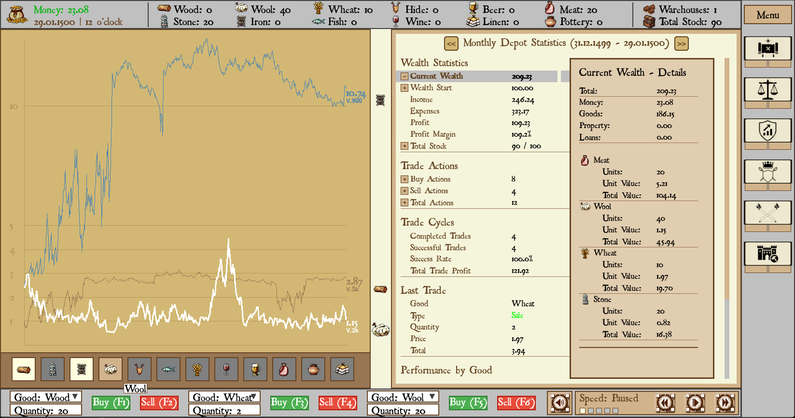
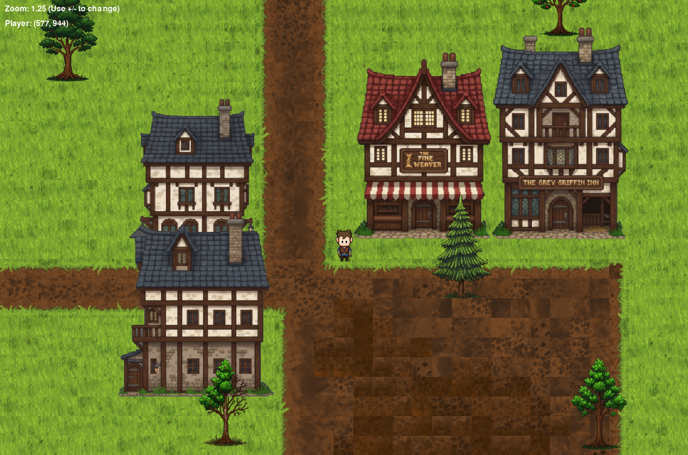
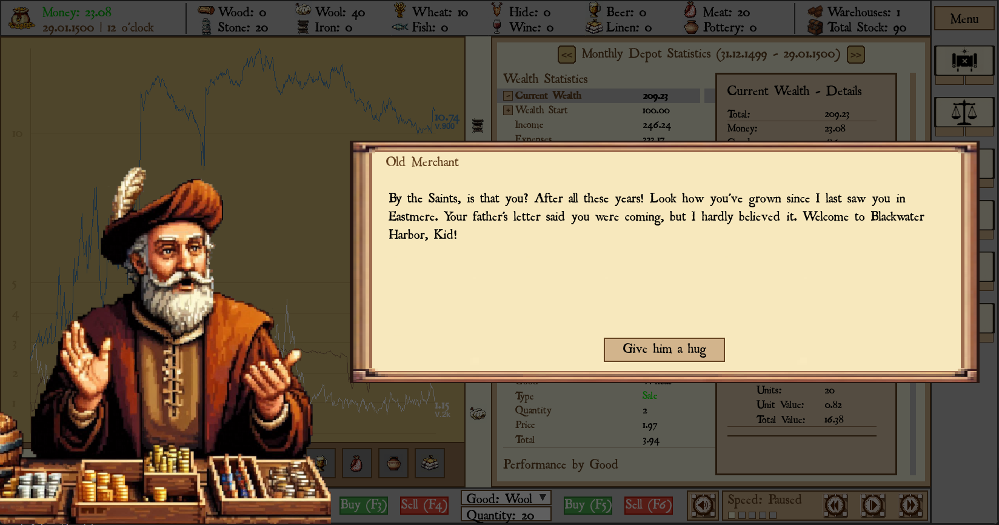

# Merchant's Rise

This is a hobby project for learning purposes: 
**Merchant's Rise** is a medieval-themed trading and economic simulation game built with Python and Pygame.

## Overview

In **Merchant's Rise**, you take on the role of an aspiring trader. Manage your depot, trade various goods, and navigate a pixel-art world to grow your wealth.

## Key Features

- **Trading System**: Buy and sell different commodities with transaction costs and dynamic market prices.

- **Depot Management**: Monitor your inventory, storage capacity, and historical wealth statistics.
- **Economic Visualization**: In-game charts and tables to track your progress and market trends.
- **Exploration Map**: A top-down tiled map system (using Tiled/TMX) where you can move your character around a medieval world.

- **First Demo of a Dialogue System**: Engage with NPCs through a simple dialogue interface, including portrait pictures, text boxes, and sound.

## Project Structure

- `main.py`: The entry point of the game.
- `src/`: Core logic and game engine.
    - `models/`: Player, Good, and Depot data structures.
    - `ui/`: Interactive UI components (charts, menus, dialogs).
    - `handlers/`: Input handling for keyboard and mouse.
    - `config/`: Game constants and color definitions.
- `assets/`: Game resources including tiles, sprites, fonts, and sound effects.
- `docs/`: Design documents and development roadmap.

## Game Controls

- **Movement**: Navigate the map using arrow keys or WASD.
- **Space**: Toggle between pause and normal game speed.
- **F1 - F6**: Hotkeys for buying and selling goods.
- **Q**: Open quit confirmation dialog.
- **Mouse**: Interact with UI buttons, input fields, and market elements.
