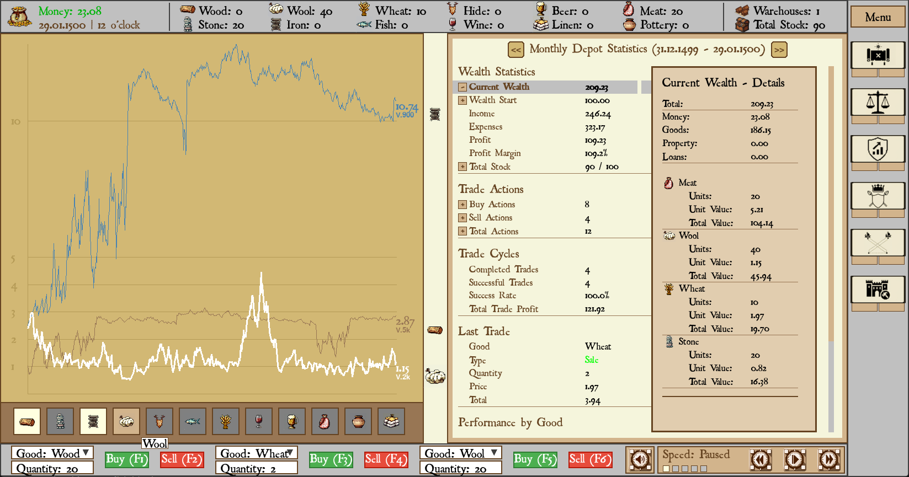
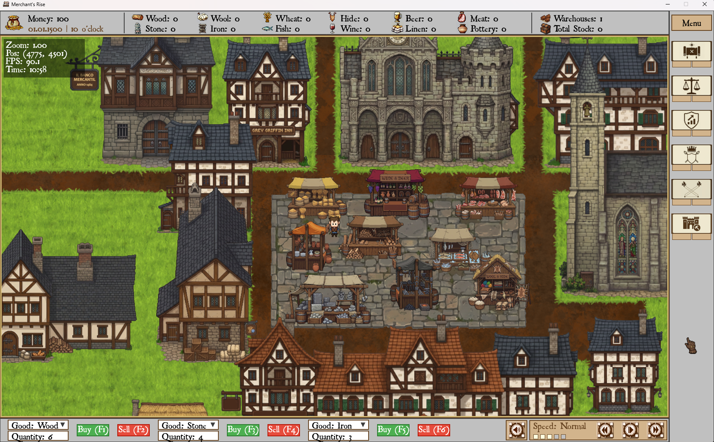
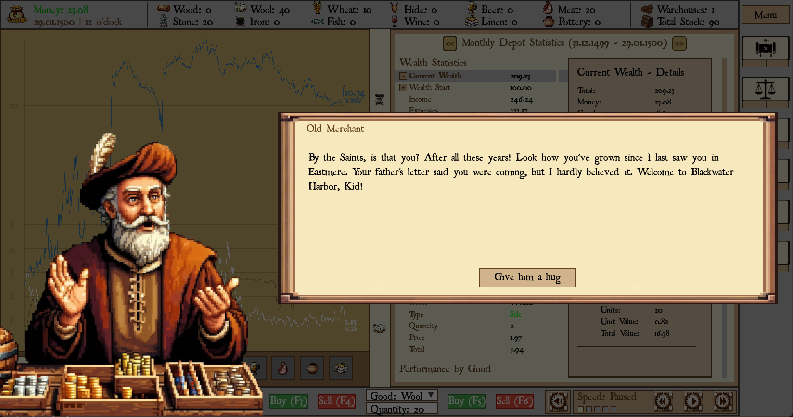

# Merchant's Rise

A hobby project for learning purposes:
**Merchant's Rise** is a medieval-themed trading and economic simulation game built with Python and Pygame.

## Overview

In **Merchant's Rise**, you take on the role of an aspiring trader in a living medieval town. Manage your depot, trade various goods, acquire trading licenses, and navigate a handcrafted pixel-art world to grow your wealth — while keeping a close eye on the town's population and their happiness.

## Installation & Running

**Requirements:** Python 3.10+

1. Clone or download the repository.
2. (Recommended) Create and activate a virtual environment:
   ```bash
   python -m venv venv
   # Windows
   venv\Scripts\activate
   # macOS / Linux
   source venv/bin/activate
   ```
3. Install dependencies:
   ```bash
   pip install -r requirements.txt
   ```
4. Start the game:
   ```bash
   python main.py
   ```

Dependencies: `pygame==2.6.1` and `PyTMX==3.32`. There are no build steps or tests.

## Key Features

- **Trading System** — Buy and sell 12 different commodities with dynamic market prices, transaction costs, and FIFO profit tracking.

  

- **Trade License System** — Each tradeable good requires a license to deal in. Licenses are acquired via contracts, cost a monthly fee, and expire after a set duration — so managing your portfolio of active contracts is part of the strategy.

- **Depot Management** — Monitor your inventory, storage capacity, and historical wealth broken down into cash, goods value, property, and loans. Stacked bar charts show your stock composition over time.

- **Economic Visualization** — In-game charts for wealth, money, stock, population, and happiness — all with hover tooltips showing the exact date, values, and breakdowns.

- **Save / Load System** — Three save slots with compressed, tamper-protected save files. All game state is persisted: economy, map position, population histories, and more.

- **Exploration Map** — A top-down tiled map (Tiled/TMX) with a zoomable, pannable camera. Walk your character through a medieval world complete with buildings, fields, trees, and animated NPCs.

  

- **Population Simulation** — The town has four social classes (Poor, Commons, Middling Sort, Nobility) whose population and happiness evolve daily. Overcrowding reduces happiness; a half-empty town gives a bonus. Watch the trends in the depot's Population and Happiness charts.

- **Living Animations** — Sheep wander around the fields and bleat when you get close. Wheat fields sway in the wind. The windmill's blades rotate continuously. Chimney smoke drifts from buildings at night. A full day/night cycle shifts the lighting and atmosphere across the world.

  

- **Dialogue System** — Engage with NPCs through a dialogue interface with portrait art, text boxes, and voice sounds.

  

- **Buildings & Institutions** — Church (with proximity bell sounds), Town Hall (population stats), Market, Bank, and Mill, each with their own interactions and visual details including night lighting effects.

## Game Controls

| Input | Action |
|---|---|
| Arrow keys / WASD | Move character on the map |
| Space | Toggle pause / normal speed |
| F1 – F6 | Hotkeys for buying and selling goods |
| Q | Open quit confirmation |
| Mouse | Interact with all UI elements |

## Project Structure

```
main.py                  Entry point
src/
  models/                Core data: Player, Good, Depot, Map, institutions
  ui/                    All UI components (charts, menus, dialogs, layout)
  handlers/              Keyboard and mouse input routing
  config/                Constants and colour definitions
  persistence/           Save / load system
assets/
  tiles/                 Tiled tilesets and TMX map file
  map_sprites/           Building and NPC sprites
  pictures/              UI icons, portraits, and buttons
  sounds/                Sound effects and music
docs/                    Design documents and development roadmap
```
